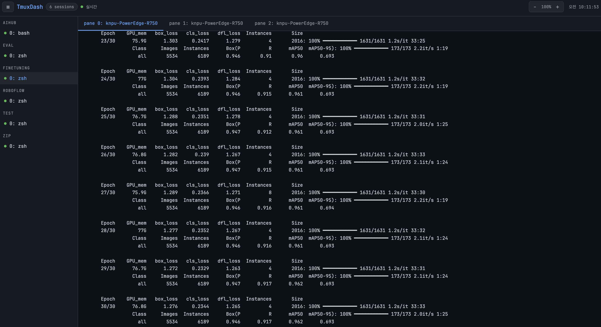

# TmuxDash
FastAPI 기반의 실시간 tmux 세션 모니터링 대시보드입니다. 웹 브라우저에서 서버의 tmux 세션과 터미널 출력을 한눈에 파악할 수 있습니다.

<p align="center">
  
</p>

## 시작하기

### 1. 가상환경 구축 및 패키지 설치

```bash
uv sync
```

### 2. 환경 변수 설정 (.env)

프로젝트 루트 디렉토리에 `.env` 파일을 생성하고 로그인 정보를 설정합니다.

```bash
cp .env.example .env
```

**.env 설정 예시:**

```env
PORT=8000
SECRET_KEY=your_random_secret_key_here
ADMIN_USERNAME=admin
ADMIN_PASSWORD=changeme
ACCESS_TOKEN_EXPIRE_MINUTES=480
```

### 3. 대시보드 실행

```bash
python3 run.py
```

실행 후 브라우저에서 http://localhost:8000 접속하여 설정한 계정으로 로그인합니다.